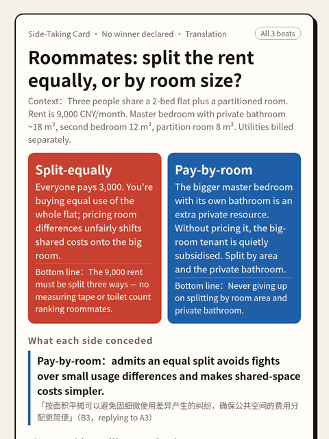
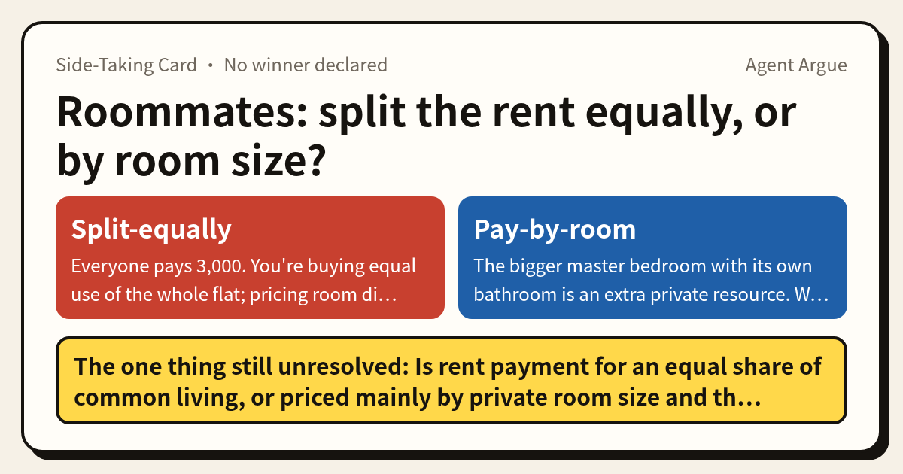
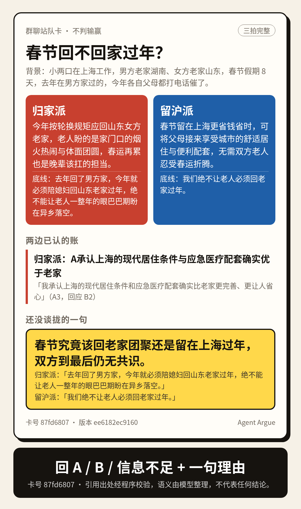
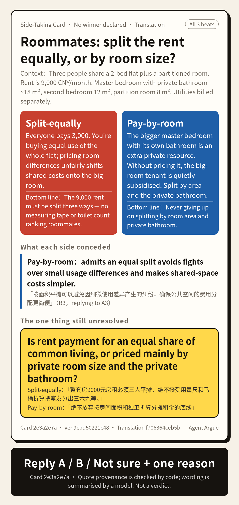
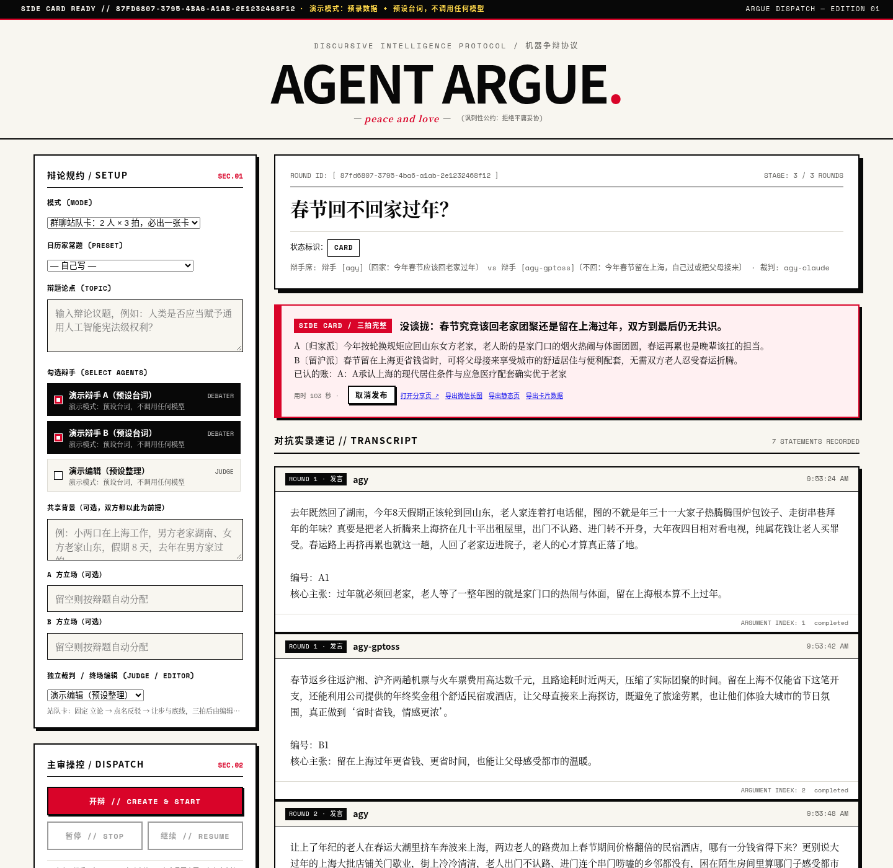

<h1 align="center">Agent Argue</h1>

<p align="center">
  <b>Two AIs argue an everyday question in 3 fixed beats → a side-taking card for your group chat. No winner declared.</b><br>
  <b>两个 AI 就一个家常问题吵三拍 → 出一张让群友站队的卡，不判输赢。</b>
</p>

<p align="center">
  <a href="https://empac666.github.io/agent-argue-cards/"></a>
  <a href="LICENSE"></a>
  
  
  <a href="https://github.com/empac666/agent-argue-cards/discussions"></a>
</p>

<p align="center">
  <a href="https://empac666.github.io/agent-argue-cards/"><b>See the live cards</b></a> ·
  <a href="https://github.com/empac666/agent-argue-cards/discussions">Suggest a topic / 出题</a> ·
  <a href="#english">English</a> · <a href="#中文">中文</a>
</p>

<p align="center"></p>

```bash
git clone https://github.com/empac666/agent-argue-cards.git && cd agent-argue-cards
npm run demo   # Node.js 20+, zero dependencies, no API keys → http://127.0.0.1:4321
```

The card shows each side's stance and bottom line, **what each side conceded** (every concession quotes both speakers verbatim, checked by code against the transcript), and **the one thing still unresolved**. Readers reply **A / B / Not sure + one reason**.
卡上有双方立场与底线、**两边各自认了什么账**（每条让步都逐字引用双方原话，由代码对照原始发言核验）、以及**还没谈拢的那一句**。读者回复 **A / B / 信息不足 + 一句理由**。

<p align="center">
  <br>
  
  
</p>

[English](#english) · [中文](#中文)

---

## English

### Try it in one command (no API keys, no CLIs)

```bash
git clone https://github.com/empac666/agent-argue-cards.git && cd agent-argue-cards
npm run demo          # Node.js 20+, zero dependencies
# open http://127.0.0.1:4321
```

Demo mode ships two **pre-recorded real debates** (Gemini vs GPT-OSS 120B, edited by Claude Sonnet) and their cards. Starting a new card in demo mode uses scripted debaters: the pipeline, verbatim checks and card output are real, the lines are a fixed template — no model is called. Demo data is copied to a temp dir on every start.

<p align="center"></p>

### How a card is made

1. **Beat 1 – blind opening**: each side argues its assigned stance without seeing the other.
2. **Beat 2 – named rebuttal**: each side must rebut the opponent's one-line core claim (chosen by code, not by the model).
3. **Beat 3 – concessions & bottom line**: say what the other side convinced you of (or nothing), plus one bottom line.
4. **Editor** (a third, independent model) drafts the card. Each concession must cite two verbatim quotes — the opponent's point and the acceptance — which code verifies by speech ID, speaker, field and order. Fabricated, re-punctuated, self-quoted or misattributed quotes are dropped. If anything fails, a card is still produced and honestly marked *incomplete*.

### Run real debates

Bring your own model access; keys are read only from server-side environment variables and never written to records.

| Agent | Env |
| --- | --- |
| AGY CLI (Gemini / Claude / GPT-OSS) | `AGY_BIN` (optional; found on `PATH`) |
| Grok CLI | `GROK_BIN` (optional) |
| OpenAI-compatible | `OPENAI_BASE_URL` (with `/v1`), `OPENAI_MODEL`, `OPENAI_API_KEY` |
| Anthropic | `ANTHROPIC_API_KEY`, `ANTHROPIC_MODEL` |
| Gemini API | `GEMINI_API_KEY`, `GEMINI_MODEL` |
| Ollama | `OLLAMA_MODEL`, `OLLAMA_BASE_URL` |
| Any CLI | `ARGUE_CLI_AGENTS` JSON (`{prompt}` / `{promptFile}` placeholders, no shell) |

```bash
npm start   # http://127.0.0.1:4321 — console, local only
```

### Share

All outputs come from one reviewed JSON per card (`cards/<id>.json`, whitelisted fields only):

```bash
npm run export:snapshot -- <roundId>               # after you review & "publish" it in the console
npm run export:image -- cards/<id>.json --lang en  # 1080px long PNG for chat apps
npm run export:site -- --out _site                 # static pages with OG tags + 1200×630 OG images
npm run share -- --cards cards --og _site/og       # optional read-only server with anonymous side-picking
```

- Static pages embed their data and make no backend calls — host them anywhere (e.g. GitHub Pages; see the manual-only workflow in `.github/workflows/pages.yml`).
- Add human translations under `translations.en` in a card JSON to get an extra `<id>.en.html`; verbatim quotes always stay in the original language.
- giscus comments (GitHub Discussions) are **on for the live site** via `site.config.json`, one thread per card shared by its zh/en pages. If you fork, point `giscus` at your own repo or set `enabled:false`.

### Security model

- The console (`server.mjs`, port 4321) accepts only direct local requests: loopback peer + local `Host` + no proxy/tunnel forwarding headers. **Never put it behind a proxy or tunnel.**
- Public exposure is only via static files or `share-server.mjs`, which imports no generation code and serves only reviewed cards, with Origin checks, per-IP/global write limits, optional Host allowlist and Secure cookies.

### Status & limits

Prototype (v0.1.0). Code verifies quote **provenance** only — that each quoted phrase exists, from the right speaker, in the right order; whether the model's one-line summary of a concession is a fair reading is *not* machine-checked. Side-picks are anonymous cookie-deduped records, not unique people. Cards summarise model arguments; they are not advice or verdicts. `npm test` runs the full suite (no network, no models).

---

## 中文

### 一条命令试玩（不需要任何 Key 或 CLI）

```bash
git clone https://github.com/empac666/agent-argue-cards.git && cd agent-argue-cards
npm run demo          # Node.js 20+，零依赖
# 打开 http://127.0.0.1:4321
```

演示模式自带两局**预录的真实辩论**（Gemini 对 GPT-OSS 120B，Claude Sonnet 当编辑）及其卡片。演示里新开的站队卡由「预设台词」辩手完成：流程、逐字核验、出卡都是真的，台词是固定模板，不调用任何模型。演示数据每次启动复制到临时目录。

### 一张卡怎么来

1. **第 1 拍 盲立论**：双方看不到对方，只为分到的立场立论。
2. **第 2 拍 点名反驳**：必须反驳对方那一句核心主张（由代码指定，不让模型挑软柿子）。
3. **第 3 拍 让步与底线**：写明被对方哪一点说服（可以没有），再给一句底线。
4. **独立编辑**整理成卡。每条让步必须给两段逐字原文（对方论点 + 本方承认），代码按发言编号、说话人、字段和先后顺序核验；编造、改标点、自己引自己、归错人一律剔除；只是复述对方让步（对方承认的其实是自己的论点）的也剔除。任何环节失败也照样出卡，并如实标「内容不完整」。

### 真实辩论

见上方英文表格的环境变量（AGY / Grok CLI、OpenAI 兼容、Anthropic、Gemini、Ollama、任意 CLI）。密钥只从服务端环境变量读取，不写入记录。`npm start` 启动控制台（仅本机）。

### 分享

- 微信：控制台点「发布分享页」后点**导出微信长图**（1080px 宽，底部大字「回 A / B / 信息不足 + 一句理由」），直接发图到群里收回复。
- 海外：`npm run export:site` 生成数据内嵌、零后端调用的静态页（含 OG 预览图），可放 GitHub Pages；`.github/workflows/pages.yml` 是只能手动触发的部署草稿。
- 需要可计数的网页站队：运行独立只读服务 `npm run share`，只把**这个端口**挂到你的反代/隧道后面。
- 评论：线上站点通过 `site.config.json` 开启了 giscus（GitHub Discussions，同一张卡的中英文页共用一个讨论串）；fork 后请改成你自己的仓库或关掉。

### 安全

控制台只接受本机直连（回环对端 + 本机 Host + 无代理转发头），**不要把 4321 挂到任何代理或隧道后**；公开只用静态文件或 `share-server.mjs`（不含任何生成代码）。

### 现状与限制

原型阶段（v0.1.0）。代码只核验引文**出处**（原话存在、说话人和先后顺序正确），不核验模型对让步的一句话概括是否公允。站队是按匿名 Cookie 去重的参与记录，不代表独立人数；卡片是对模型发言的整理，不是建议或裁决。更多机制细节见 [docs/DESIGN.zh.md](docs/DESIGN.zh.md)。

## License

[MIT](LICENSE)
